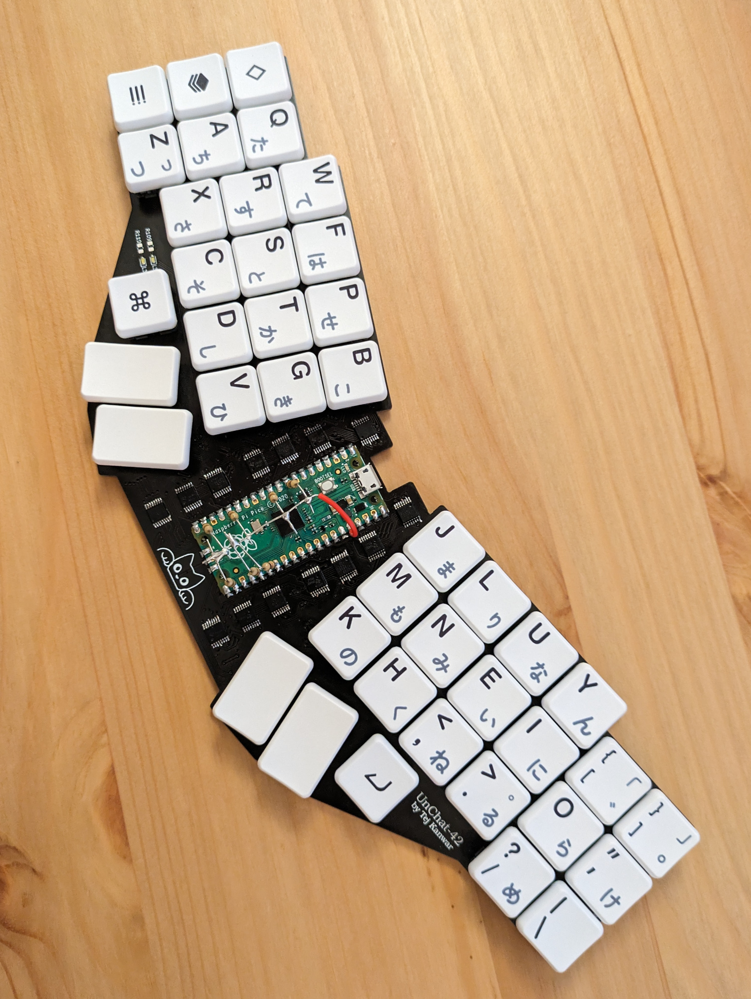
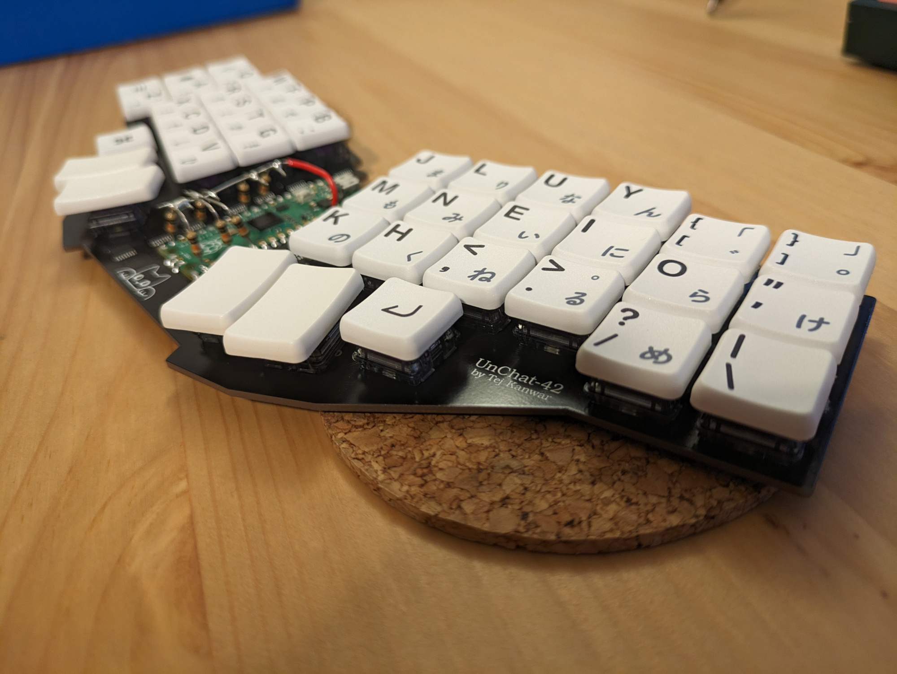
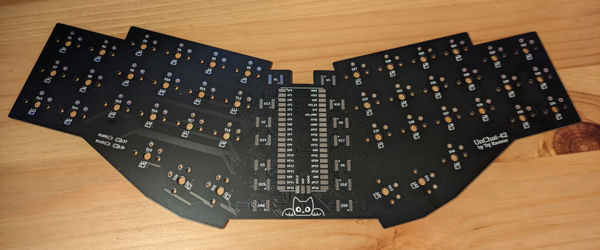
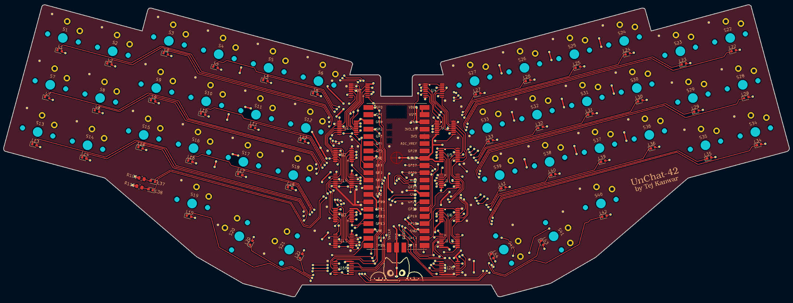
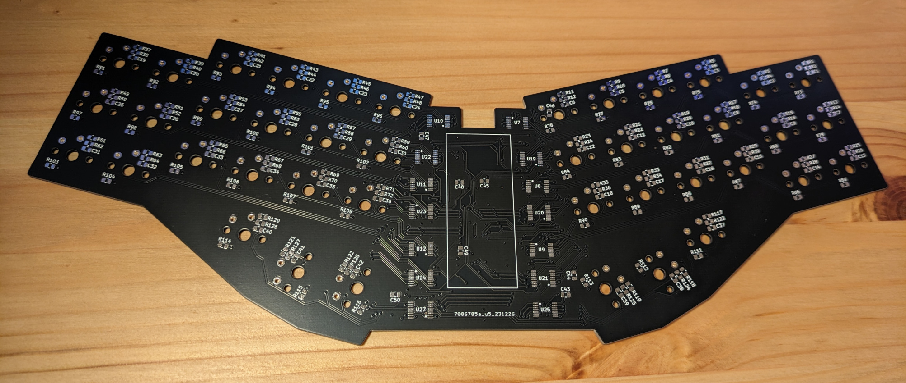
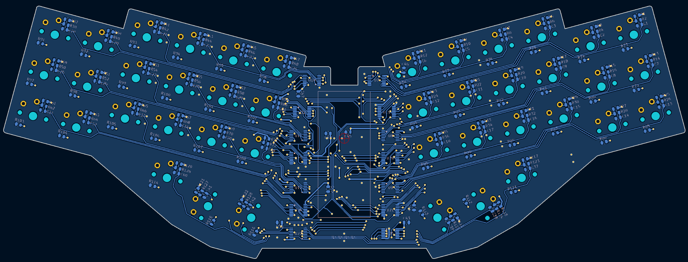
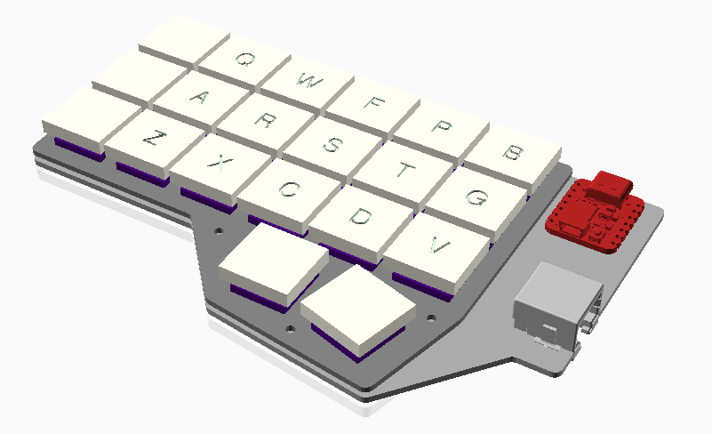
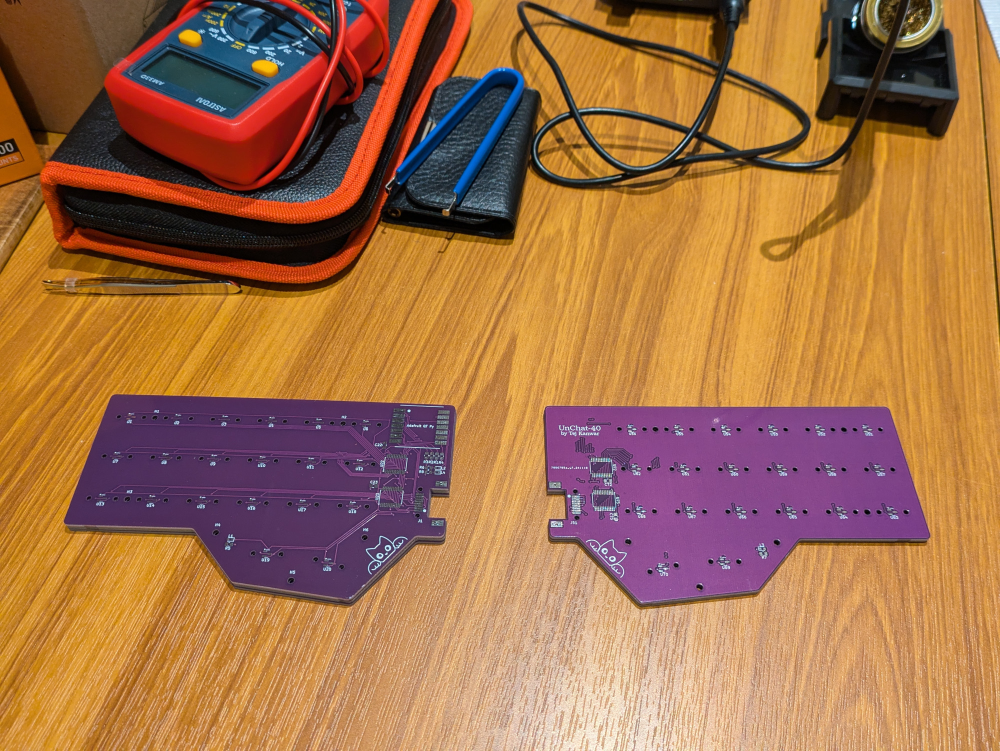
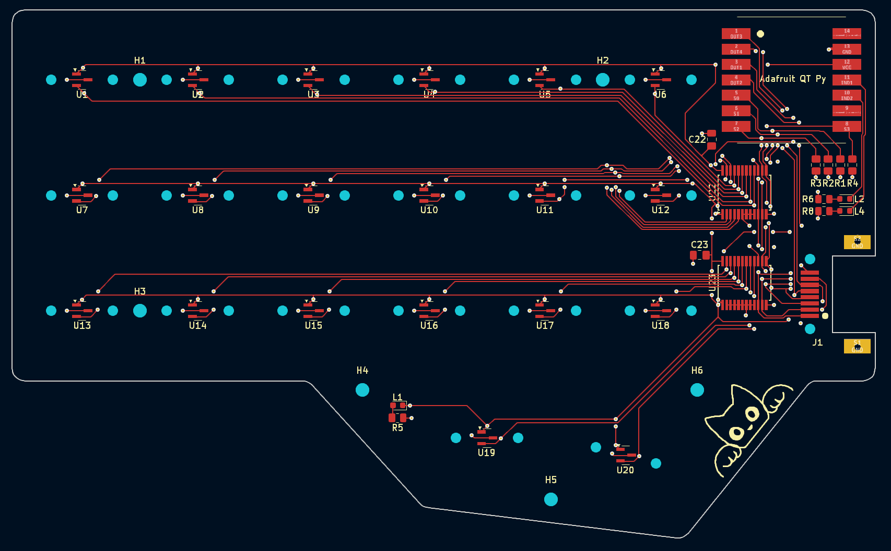
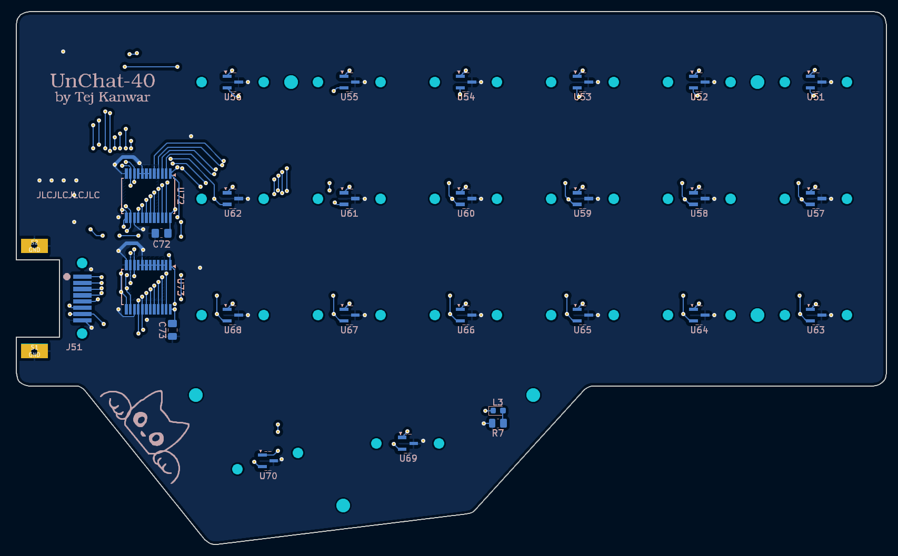

# Overview
This repository contains the design materials, firmware, and related docs for
two iterations (2023 and 2024) of the **"Unchat" keyboard**.  Highlights of this
design include:

 * An **ergonomic, split form keyboard** with 40 keys (2024) or 42 keys (2023)
 * **Custom Rust firmware** supporting QMK JSON keymaps using a limited feature set
 * **Hardware chatter mitigation** through Hall Effect magnetic switches (2024)
   or hardware debouncing circuitry (2023)
 * **Diode-free** using a 6-bit bus (2023) or 4-bit analog muxes (2024)

Here are some photos.

The **Unchat-42 (2023)**:

Designing the PCB in Kicad and the results:

The **Unchat-40 (2024)** (assembly still WIP):

## Why design a custom keyboard?
This project was motivated in small part by wanting to solve frustrating key
chatter on my main keyboard and in larger part as a way to kill free time during
holiday seasons. It was an awesome way to learn several new skills. I recommend
this sort of project if any of these interest you as well:

 * PCB design in Kicad
 * Mechanical design in OpenSCAD
 * Electronic assembly and debugging
 * Embedded Rust

## Free to use and share
Designs and code in this repository are covered by the CC0 license, allowing
anyone to freely copy, modify, or distribute these materials. Attribution not
required.

That said, there are some known issues with the original designs. These are
documented below, along with my workarounds. In some cases, these issues are
corrected in the latest design files, but corrections have not been tested. You
may discover other issues that I have not personally encountered. **Use at your
own risk!**

# Unchat-40 (2024)

## Design overview
Summary of design features:

 * Two **reversible PCBs** connected via RJ45
 * Controlled by an **Adafruit QT Py RP2040**
 * **Hall-effect** switches queried via **analog muxes**
 * Acrylic and/or aluminum plate and frame

The 2023 design was fairly successful at reducing key chatter without software
debouncing, but I still experienced occasional chatter (see below).
Unfortunately, this was on timescales far above the filtering provided by the
hardware debouncing, likely due to corrosion and mechanical deformation in the
switches due to my terrible assembly process.

With this new 2024 design, I entirely circumvented using electrical contacts by
moving to a Hall Effect magnetic switch design. This is also used in some
"gaming-friendly" keyboards because it allows very rapid triggering, but from
the perspective of this design the main advantage is that we can apply
**hysteresis** to completely eliminate chatter. The cheap DRV5055 sensor
fit the design perfectly. Unfortunately, magnetic switches are still fairly
rare and a bit more pricey, but the overall cost was still manageable.

## Electronic design

## Mechanical design

## Cost breakdown

# Unchat-42 (2023)

More design info and post-mortem coming soon!
